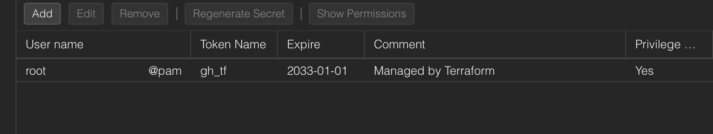
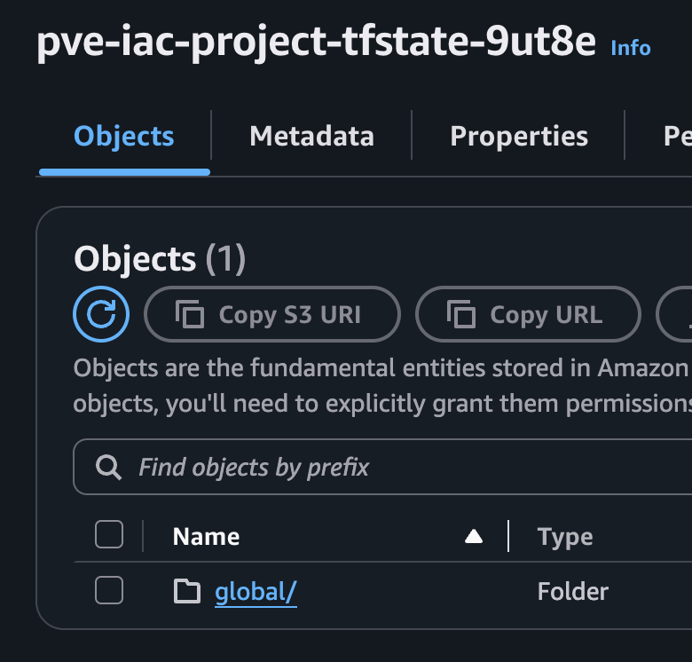

For the remote Terraform state, I'm using an S3 bucket in my AWS account.

This Terraform code needs to be deployed first before anything else. In a GitHub actions workflow, I can use a `needs:` directive.

An S3 bucket for Terraform remote state needs the following resources for secure and resilient configuration:
- aws_s3_bucket
- aws_s3_bucket_versioning
- aws_s3_bucket_server_side_encryption_configuration
- aws_s3_bucket_public_access_block
- aws_dynamodb_table

This solution presents a chicken-and-egg problem - We want a remote S3 backend, but the bucket hasn't been created yet to store the Terraform state.

So we need to run the Terraform code once locally, then *migrate* the state to the newly created bucket and configure Terraform with a remote S3 backend.

After running the new Workflow, I can see the API token created and S3 bucket containing the Terraform state

